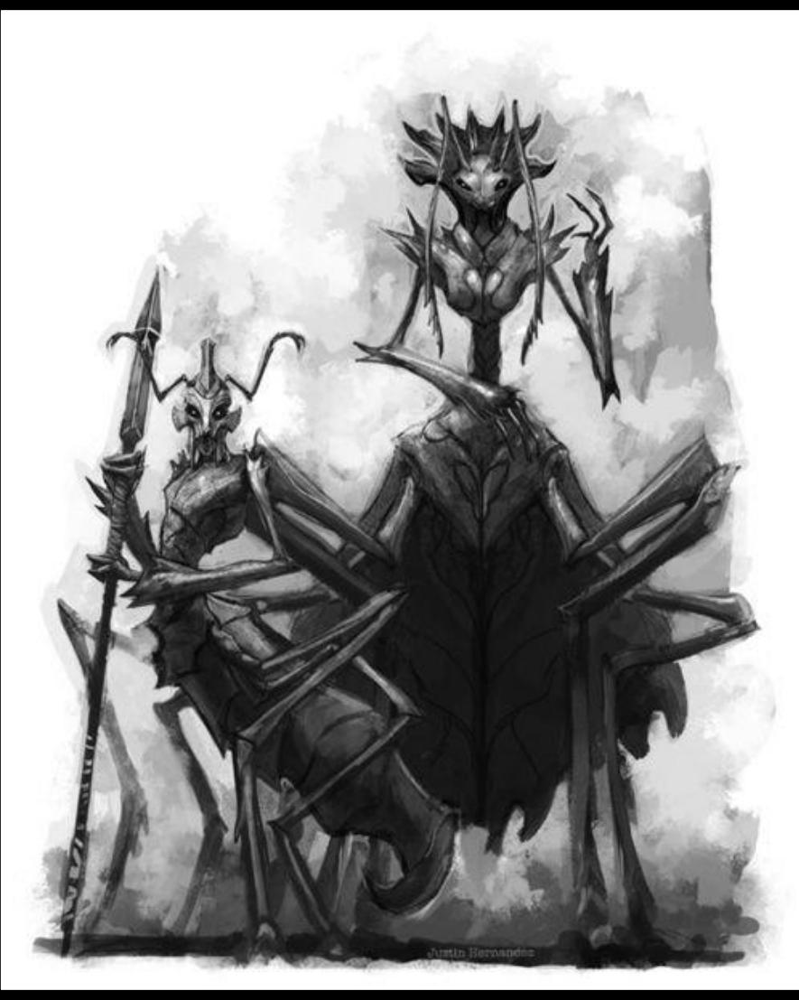
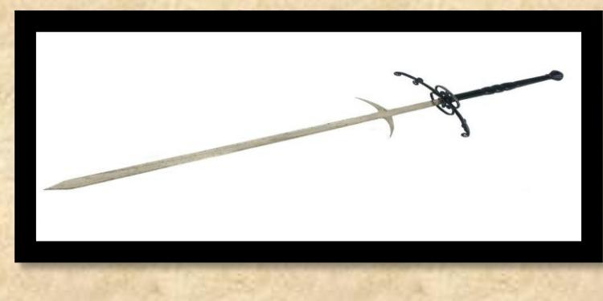
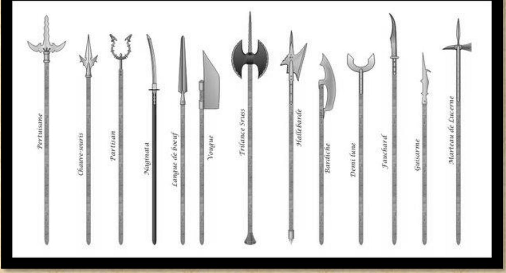

# LES ARAKNES ∞∞

## APPARENCE

Les Araknes sont des créatures hybrides, originaires du continent de Caderaye, combinant un torse de fourmis noires, des pattes chitineuses à trois doigts, et un abdomen d'araignée orné de quatre pattes. Ils mesurent environ 1m50 de hauteur et de longueur, pour un poids avoisinant les 70 kg et leur espérance de vie n'excède pas 30 ans. Leur visage est pourvu de deux yeux, deux antennes, et quatre mandibules. La classe dirigeante adopte un style vestimentaire rappelant la mode gothique de la Renaissance victorienne, tandis que le peuple porte un simple tabard aux couleurs de sa famille.

> « Il faut que le hasard renverse l'arakne pour qu'il voit le ciel. » « Enfin libre !!! »

## HISTORIQUE

Les Araknes ont quitté leur monde arboricole pour se retrouver piégés dans des roches et des grottes mortelles, sur ordre de la reine nourricière. Dévoués corps et âme aux  reines mères, grâce à un lien difficile à comprendre pour les profanes, ils considèrent la reine nourricière, mère des reines mères, comme une divinité immortelle. Cette dernière est alliée à des shamans noirs bipèdes, aux désirs mystérieux, qui servent de conseillers à chaque reine mère. Le palais de la reine nourricière est si bien dissimulé qu'on raconte qu'il se déplace à chaque cycle.

Les palais des reines mères sont des structures complexes, composées de tunnels en chitine et de passages en soie qui relient des pièces aux formes non euclidiennes, défiant les lois de la géométrie. Les espaces intérieurs semblent se déformer et s'étendre de manière imprévisible. Des toiles barbelées, faites de fils tranchants, séparent les pièces. Ces passages, tissés avec une précision arachnéenne, vibrent légèrement au passage de chaque être vivant, comme s'ils réagissaient à leur présence. Chaque pièce est unique, certaines semblent plus grandes à l'intérieur qu'à l'extérieur, d'autres semblant s'étirer vers l'infini ou se refermer en une spirale sans fin. C'est ici que les œufs sont stockés et protégés jusqu'à leurs éclosions

Seules les reines peuvent se reproduire. Elles pondent des milliers des œufs quotidiennement et chaque Arakne est assigné à une tâche dès sa naissance jusqu'à sa mort. Ces créatures sont asexuées et dociles envers leur reine mère et les désirs qui émanent d'elle.

## VIE DE NOS JOURS

Les Araknes se nourrissent de lichen, de champignons et, selon les rumeurs, de cadavres. Ils sont souvent perçus à tort comme des monstres ou des esclaves. Les reines mères les asservissent, les obligeant à produire de la soie pour piéger le ciel ou à récupérer du magma au cœur du volcan inversé de Blinkel. Ils déploient une énergie colossale pour recouvrir le ciel de la coque avec un tissage complexe de toiles, créées par des araignées géantes domestiquées appelées les fileuses. Les enfants Araknes sont vendus à des caravaniers pour être exploité plus tard dans des usines gobelines.

Les reines mères se partagent les territoires de Shek, Sorna et Blinkel, où elles organisent la lutte contre les parasites, la production des fileuses, la vente d'esclaves, ainsi que la livraison de magma et de nourriture.

En combat, les Araknes piègent leurs ennemis, les Parasites, dans leurs toiles tendues le long des couloirs souterrains. Leurs écoles d'escrime se spécialisent dans le maniement de l'espadon et de la lance, armes qu'ils jugent les plus efficaces.

Depuis l'arrivée de la reine nourricière, des groupes d'archéologues, incluant des guerriers asservis et des espions fanatiques, sont envoyés pour retrouver des vestiges historiques, tels que des témoignages écrits et des témoins vivants de la première collision.

Les Araknes expatriés, s'émancipent du joug des reines mères, découvrant l'indépendance, la soif de liberté et l'individualité (des sentiments inconnus pour les araknes commun). Souvent, ils retournent sur la coque pour libérer leurs frères de ce qu'ils appellent la domination divine. Ces infiltrés avides de liberté sont devenus la bête noire des shamans, qui leur livrent une guerre impitoyable via leur police politique l'ombre toile.

> Cf les cultes, les Araknes

MAGIE Pas de rune de base Rituel de la terre et du feu

AVANTAGES Chitine Lance toile Pas d'insecte Mandibule Produit de la toile Marche sur les murs Vision nocturne

CARACTERISTIQUES Taille 4 Perception et Dextérité +1 Social et arcane magique -1

COMPETENCES Discrétion Mouvement

Con. Race Araknes – SPECIAL Con. Race Nains Con. Terrains Barrage de Feu Con. Terrains Magma de Blinckel Con. Terrains Mondes Souterrains – SPECIAL Con. Terrains Nid Parasite Connaissance Parasites Talent chasseur

Talent éleveur Talent esclave Cracher toile Résistance

## Avantages et désavantage de race

## Vision nocturne 1

Voit dans le noir à 10 mètres Vous êtes nyctalope, vous voyez dans une très faible luminosité

# Marche inversée 2

Marche au plafond et sur les murs

Vos pattes sont constituées de mini griffes (tarses) qui vous permettent de marcher la tête en bas.

# Mandibule 1/2/3

Augmente les dégâts en bagarre de 1/2/3 Les mandibules surdéveloppées permettent de grandes attaques par morsure

# Produire de la toile 1

Permet de synthétiser un fils de toile pour un PM qui dure 2 jours en une minute L'arakne crée par ses glandes salivaires un fils de toiles qui en passant entre ses mandibules devient lisse et solide

#### Lance toile 1/2/3

Lance un fil de soie collante et très résistante Portée 5/10/20 mètres, coût1 PS

Jet cracher toile + intuition + dextérité. Force adhésive -2 / -3 /-4 au jet de force + hargne + logique. Le joueur synthétise entre ses mandibules faciales un fil de soie solide et collant pendant une minute.

# Chitine 2

#### Armure 1

Les araknes naissent avec une peau de chitine leur assurant une armure naturelle arrêtant 1 points de dommage.

Note Pour incarner un Arakne, il est nécessaire de jouer un personnage ayant déjà été émancipé (par le biais d'un voyage, d'un groupe d'exploration, d'une ancienne condition d'esclave gobelin, ou par adoption). Alternativement, il est possible de s'entendre avec le MJ pour explorer en jeu la découverte du sentiment de liberté et d'autonomie qui naît avec l'éloignement de la reine.
