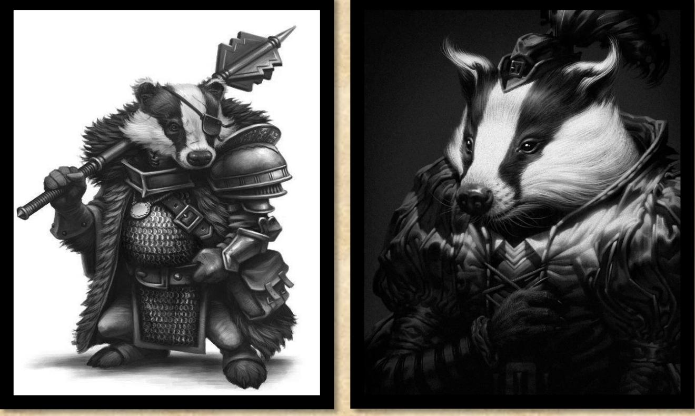
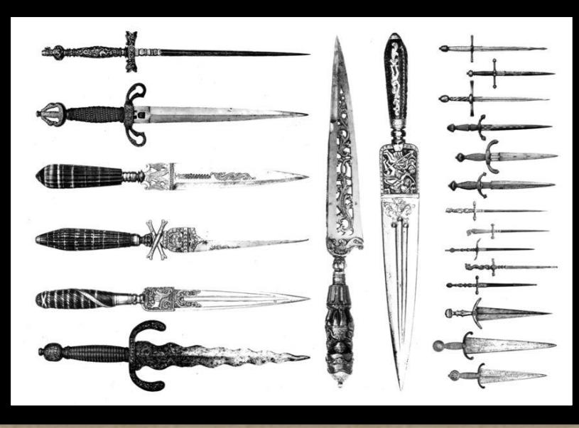

---
---

# LES CARKAGES ∞∞

## APPARENCE

Originaire des terres lointaines de Caderaye, les Carkages ressemblent à des carcajous ou à des blaireaux garous, avec un pelage allant du gris foncé au noir, agrémenté de taches blanches, mesurant 1m45 pour 55kg. Leur espérance de vie est de 50 ans. Leur style vestimentaire victorien-médiéval mélange des corsets et des jupes longues ornées de dentelle avec des capes, des manches bouffantes et des broderies complexes, évoquant une élégance gothique et romantique. Les males portent des vestes ajustées, des chemises à jabot, des bottes hautes et des accessoires en cuir et métal, rappelant les courtisans et les nobles.

> CITATION : « on ne me paie pas pour des moutons… »

## HISTORIQUE

L'histoire des Carkages remonte à leur création par des alchimistes audacieux. Ces derniers ont transfusé l'âme d'un démon primordial dans les ancêtres des Carkages, faisant d'eux une arme ultime. Mais au lieu de rester sous le joug de leurs créateurs, les Carkages se sont rebellés, tuant leurs maîtres, devenant indépendants. Leur unité est renforcée par leur foi en Telra.

Au cours de leur histoire mouvementée, les Carkages ont également pactisé avec les démons, fuyant leur planète d'origine lors de la deuxième collision. Ils ont utilisé la magie des portails pour téléporter leur cité, Ryldrak, dans les montagnes. Cette cité est dissimulée au cœur d'un labyrinthe de grottes et de tunnels, gardée par des démons liés qui attaquent les intrus. Des portails et des pierres gravitiques dissimulés empêchent toute orientation et protègent la cité mère, rendue inaccessible par des falaises abruptes.

Les Carkages utilisent des taupes géantes, dressées avec du sang démoniaque, pour creuser leurs tunnels, mais ces créatures finissent souvent par devenir berserks, contribuant ainsi à la formation d'un labyrinthe souterrain. Les Carkages ne communiquent avec l'extérieur que par le biais de portails reliés à leurs maisons des plaisirs. Ils vivent dans un système matriarcal, où les hommes occupent principalement des rôles de guerriers ou d'assassins, tandis que les femmes sont ritualistes et tatoueuses.

Il existe cinq familles Carkages qui se disputent le pouvoir et la place de famille régnante. La famille au pouvoir, a accès aux rituels de téléportation qui ont permis à la forteresse de se cacher dans les montagnes oubliées. Les rituels liant les démons aux Carkages sont monnaie courante.

> cf. le culte de Telra 5.6.8 et 6.5.13

## DE NOS JOURS

Les Carkages sont toujours en guerre discrète avec les Racszaks. Ils sont également présents dans les guildes d'assassins, où ils se vendent en tant que spécialistes inégalés. Leur mode de vie n'a guère changé au fil des millénaires, mais ils ont créé les palais de la connaissance, en collaboration avec les Lacustres, présents dans toutes les grandes villes, afin d'étendre leur pouvoir et leur influence.

La Guilde d'assassin rassemble des experts, mais chacun doit alterner ses méthodes opérationnelles pour honorer Telra comme il se doit. Bien sûr, personne n'est conscient de la dimension néfaste de leur croyance. De nombreux membres restent inactifs et altruiste pendant des années afin d'être insoupçonnable le moment venu… De plus, les maisons des plaisirs organisent de nombreuses actions de bienfaisance, masquant ainsi leurs véritables intentions.

Certains Carkages ont fui par peur des sanctions et vivent cachés dans des cités riches, tandis que d'autres ont été bannis et se sont réfugiés dans des terres éloignées. On entend également parler d'ermites errants Carkages repentis, qui ont consacré leur vie à aider les plus démunis, cherchant ainsi à racheter leurs péchés passés.

> cf guilde des palais de la connaissance

## Incarner un Carkage

### MAGIE

- Rituel de feu et de terre
- Rune de portail autorisé

### AVANTAGES

- Déplacement dans les ombres
- Vision nocturne
- Calme
- Sincèrement sincère
- Sanguinaire

### Désavantages

- Eblouis par le soleil

### Caractéristiques

- Taille : 4
- Intuition et Coordination : +1
- Ame et Social : -1

### Compétences

- Discrétion
- Mouvement
- Observation Con. Race : Carkages - SPECIAL
- Con. Race : Racszaks
- Con. Terrains : Cité de Ryldrak - SPECIAL
- Connaissance : démons
- Connaissance : drogues
- Connaissance : poisons
- Déguisement
- Sagacité

### Avantages et désavantage de race

- Vision nocturne 1

Voit dans le noir à 10 mètres Vous êtes nyctalope, vous voyez dans d'une très faible luminosité

- Déplacement dans les ombres (carkage) 3 1 mètre/Pt magie, 1 action

Le sang démoniaque qui coule chez les carkages leur octroie la capacité à se téléporter d'ombre en ombre. Ils doivent voir l'ombre de destination et saute dans celle de départ pour y disparaitre.

- Eblouis par le soleil -1

Malus de 2 en cas d'exposition sans protection Vous êtes ébloui par la lumière du jour. C'est ça d'être un vrai troglodyte. Avec des lunettes fumées tout va mieux.

