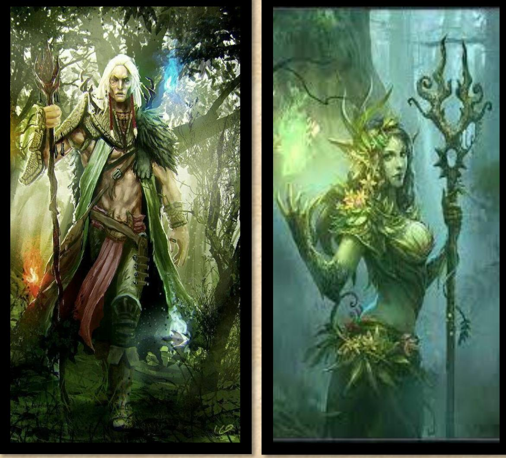
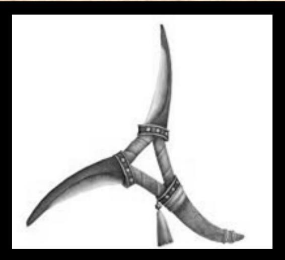

---
---

# LES PASSEURS OCCULTES

## APPARENCE

Les Passeurs occultes mesurent environ 1m80 et pèsent 75 kg. Leur peau est d'un vert foncé ou marron claire, et ils ont des oreilles pointues ainsi que des yeux en amande. Leurs cheveux sont de multiples couleurs chatoyantes. Leur espérance de vie est de 150 ans. Leur style vestimentaire combine des tuniques en cuir souple et des pantalons ajustés en toile sombre, ornés de motifs de feuilles pour le camouflage, avec des capes à capuche en lianes et des bottes en peau souple.

CITATION : "La bourse ou la vie ?"

## HISTORIQUE

Pendant la grande guerre, les elfes sylvains ont péri aux côtés des hauts elfes. Cependant, un groupe important de contrebandiers, de brigands et de lâches a choisi de ne pas se battre. Ils ont été pourchassés par les Orcs dans la forêt d'ombre, mais ont été sauvés par les anciens déracinés qui toléraient les sylvains mais pas les incursions Orcs.

## VIE DE NOS JOURS

Les Passeurs occultes vivent désormais de pillages et de commerce le long de la grande route. Pour eux, les Orcs restent l'ennemi qui a provoqué leur déclin. Autrefois des elfes sylvains, ils sont devenus les Passeurs occultes. Ils se battent avec des boomerangs de sève, qu'ils échangent d'arbre en arbre pour déstabiliser leurs cibles et apparaître partout à la fois. Les arbres enchantés des Elfes fournissent une sève plus dure que l'acier. Elle est utilisée pour remplacer le métal. En effet le métal est interdit dans la forêt d'ombre par les Elfes traditionnalistes et les déracinés.

Les Passeurs occultes se sont organisés en petits groupes de guerre, guidés par les druides. Leurs villages sont cachés à mi-hauteur dans les arbres, souvent harcelés par les hordes de goreloups. Ils luttent également contre les pousses et les anciens qui leur bloquent certaines zones de la forêt. Les Habitants des Cimes contestent également leurs territoires de chasse. Les Passeurs occultes vivent en osmose avec la forêt et sont les meilleurs éclaireurs de la grande route.

Le rite de passage à l'âge adulte consiste à expulser les adolescents des villages et à leur interdire d'être vus pendant le jour. Les exilés n'ont pas le droit de se regrouper et doivent vivre de rapines, de chasse ou de cueillette pendant deux ans. Beaucoup de Passeurs occultes deviennent voleurs, chasseurs, cueilleurs, dompteurs de skrills ou herboristes. La flore carnivore est dangereuse et la faune est hostile en raison de ses prédateurs tels que les chenilles géantes acides et les dragons verts.

Les quelques Passeurs occultes, alliés aux Habitants des Cimes, qui ont réussi à éloigner les bêtes du fleuve sont devenus les contrebandiers du fleuve coupé. Ils sont très doués pour revendre leurs larcins aux Fenris et aux Nains qu'ils rencontrent via le fleuve. Ces parias ont un statut à part qui les unit.

Cf. chapitre les cultes

## Créer un passeur occulte

### MAGIE

Rituel de la vie et de la nature

### AVANTAGES

- Parle aux bêtes
- Déplacement forestier
- Ouïe surdéveloppée
- Faire fleurir des plantes
- Beau gosse
- Espion des runes

### CARACTERISTIQUES

- Taille : 5
- Perception et Rapidité : +1
- Endurance et Sang-Froid : -1

### COMPETENCES

- Discrétion Mouvement
- Con. Race : Passeurs occultes - SPECIAL
- Con. Race : Déracinés Con. Race : Habitants des Cimes
- Con. Terrains : Forêt d'ombre - SPECIAL
- Connaissance : plantes
- Talent : chasseur
- Talent : dresseur
- Talent : herboriste
- Forgeron de sève Pièges
- Survie

### Avantages et désavantages de race

- Parle aux bêtes 1/2/3

Bonus en dresseur de +2/+4/+6 Vous murmurez à l'oreille des raptors et ils vous écoutent.

- Déplacement forestier 1/2/3

En forêt, bonus en furtivité et contre le pistage : +3/+6/+9. Vous vous déplacez en forêt avec une fluidité surnaturelle, vos mouvements semblent presque danser à travers les sous-bois. Vos pas sont silencieux, à peine perceptibles sur le sol tapissé de feuilles mortes.

- Ouïe surdéveloppée 1/2/3

Bonus en perception (écouter) : +2/+4/+6 Votre ouïe est sensible et peut entendre des sons inaudibles aux commun des inhumains

\*Enchanter la nature 1

- Faire fleurir des plantes 1PM/10m²

Vous avez la main verte et vous pouvez à volonté déclencher le fleurissement des plantes

